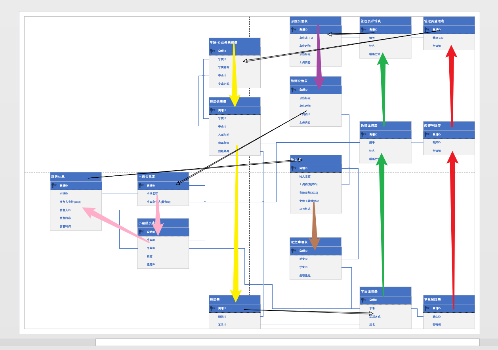

# selection_of_college_graduation_design
# 毕业设计 - 高校毕业设计选题系统

## Information about project

## 进度管理

* 登陆
  *   学生登陆管理 (✅)
  *   教师登陆管理 (✅)
  *   管理员登陆管理 (✅)
* 后台信息
  *   班级信息初始化<管理员> (✅)
  *   学院-专业-班级关系的CRUD (✅)
  *   班级成员的CRUD (✅)
  *   小组信息的设计 (未完成)

### 项目语言信息

|  | 名称 | 版本 |
| --- | --- | --- |
| 语言 | Java | 13.1 |
| 框架 | Spring Boot | 2 |
| 数据库 | MySQL | 8.0.17 |

### 项目作者信息

| 项目名称 | 高校毕业设计选题系统 |
| --- | --- |
| 作者 | 刘鹏 |
| 指导老师 | 兰孝文 |
| 开始时间 | 2020-01-08 |
| 版本 | V 1.0.0 |
| 软件结构 | B\S , C\S |

## Databases Design

## 关于我

### 联系方式

* 电子邮件
    * LIUPENG.0@outlook.com
    
    